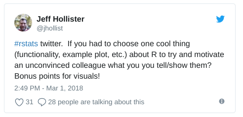

class: center, middle, inverse

```{r setup, include=FALSE, message=FALSE}
options(htmltools.dir.version = FALSE)
#library(mapview)
#library(lakemorpho)
#library(elevatr)
#data(lake)
#data(pt_df)
```

# Twitter?


### hashtag: \#rstats \#openscience
### me: @jhollist

---
class: center, middle, inverse

# Why Code/Open Science/Etc?

---

# Why?

- Reproducibility
- Automation
- Precision
- Demand
- Really Cool Tools in R



---

# Why R (or what can't R do)?

---
class: center, middle, inverse

# Community

---
class: center, middle
background-image: url('figures/2017-03-19-facesofr.jpg')
background-size: cover

# [Maelle Salmon's Faces of R](http://www.masalmon.eu/2017/03/19/facesofr/)

---
class: center, middle, inverse

# R Markdown

---
class: center, middle, inverse
background-image: url('figures/document.png')
background-size: cover

# [Documents](https://raw.githubusercontent.com/svmiller/svm-r-markdown-templates/master/svm-rmarkdown-article-example.Rmd)

---
class: center, middle, inverse
background-image: url('figures/html_widgets.png')
background-size: cover

# [Interactive Documents](https://rpubs.com/jcheng/leaflet-layers-example)

---
class: center, middle, inverse
background-image: url('https://d33wubrfki0l68.cloudfront.net/d9a44be37fffb907e3b2a12a5dc795b6e3ff6d98/99b42/galleryimages/book2.png')
background-size: contain

# [Books](https://bookdown.org/yihui/bookdown/)

---
class: center, middle, inverse
background-image: url('figures/dashboard.png')
background-size: cover

# [Dashboards](https://gallery.shinyapps.io/cran-gauge/)

---
class: center, middle, inverse

# Shiny

---
class: center, middle, inverse
background-image: url('figures/shiny_example1.png')
background-size: cover

# [Genome Viewer](https://shiny.rstudio.com/gallery/genome-browser.html)

---
class: center, middle, inverse
background-image: url('figures/shiny_example2.png')
background-size: cover

# [Philly School Resource Mapper](https://datasociety.com/kitamba-the-opportunity-project/)

---
class: center, middle, inverse

# Data Visualization

---
class: center, middle, inverse
background-image: url('https://github.com/jhollist/crabs/raw/master/figures/size_fig.jpg')
background-size: cover

# [Density Distributions](https://github.com/jhollist/crabs/blob/master/figures/size_fig.jpg)

---
class: center, middle, inverse
background-image: url('https://github.com/jhollist/crabs/raw/master/figures/crab_cor_fig.jpg')
background-size: cover

# [Correlation Matrix](https://github.com/jhollist/crabs/blob/master/figures/crab_cor_fig.jpg)

---
class: center, middle, inverse
background-image: url('http://binarystore.wiley.com/store/10.1002/ecs2.1321/asset/image_n/ecs21321-fig-0011.png?v=1&s=a0d6e4b78a29302d17e67ccfbf9a20e52b550792')
background-size: cover

# [Maps](https://github.com/USEPA/LakeTrophicModelling/blob/master/R/ts_prob_map.R)

---
class: center, middle, inverse
background-image: url('https://i0.wp.com/flowingdata.com/wp-content/uploads/2011/05/5-black-theme1.jpg')
background-size: cover

# [Connection Maps](https://flowingdata.com/2011/05/11/how-to-map-connections-with-great-circles/)

---
class: center, middle, inverse
background-image: url('https://www.r-graph-gallery.com/wp-content/uploads/2016/03/123_Circlize_Package_2.png')
background-size: cover

# [Circular Plots](https://www.r-graph-gallery.com/123-circular-plot-circlize-package-2/)

---
class: center, middle, inverse
background-image: url('figures/sankey.png')
background-size: cover

# [Interactive Sankey Diagrams](https://plot.ly/r/sankey-diagram/)

---

# Links for more motivation!

- [R Graph Gallery](https://www.r-graph-gallery.com/)
- [R Markdown Gallery](https://rmarkdown.rstudio.com/gallery.html)
- [Shiny Gallery](https://shiny.rstudio.com/gallery/)
- [Show Me Shiny](https://www.showmeshiny.com/)

---

# Thanks!
.center[
@rachelss, @benmarwick, @old_man_chester, @mark_scheuerell, @lowbrowR, @joshua_ulrich, @ma_salmon, @StephdeSilva, @Colauttilab, @jcardille, @GergelSarah, @noamross, @juliasilge, @RallidaeRule, @jebyrnes, @NSilbiger, @hormiga, @ctitusbrown, @gretchen_H2O, @TRACE_LAB, @AdamGruer, @ds_floresf, @CassieFreund, @KennyPeanuts, @mattansb, @iainmwallace

Slides created via the R package [**xaringan**](https://github.com/yihui/xaringan).
]

